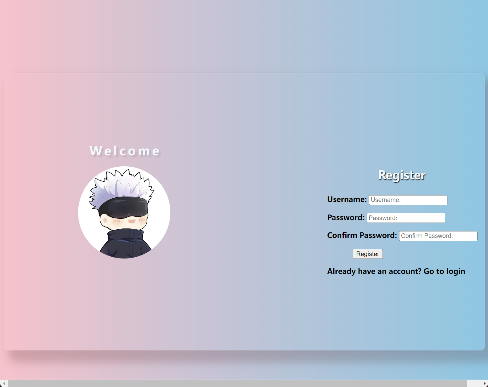

# Frontend Web Login Interface

This is a simple frontend web login interface designed for use in web development projects. It provides a user-friendly login page with options for both logging in and registering.
>warn: Only frontend without backend functionality.

## Installation

To use the Frontend Web Login Interface in your project, simply download or clone this repository to your local machine:


```shell
git clone https://github.com/zzl7181/Frontend-Web-Login-Interface.git
```

Then, open the `login.html` file in a web browser to view the login interface.

## Features

- Provides a login form for users to enter their username and password.
- Includes options for both logging in and registering for new accounts.

## Usage

To use the login interface, open the `login.html` file in a web browser. 

## Screenshots




## License

This project is licensed under the MIT License - see the [LICENSE](LICENSE) file for details.

